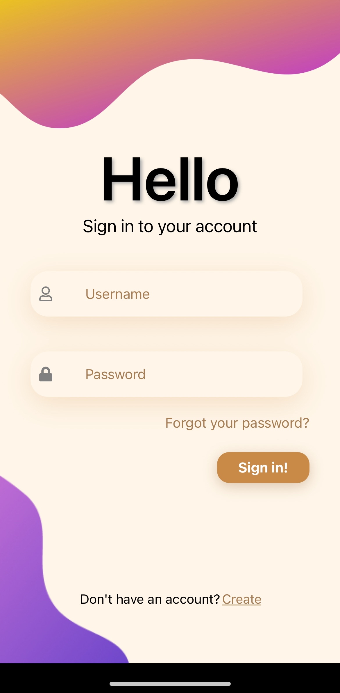
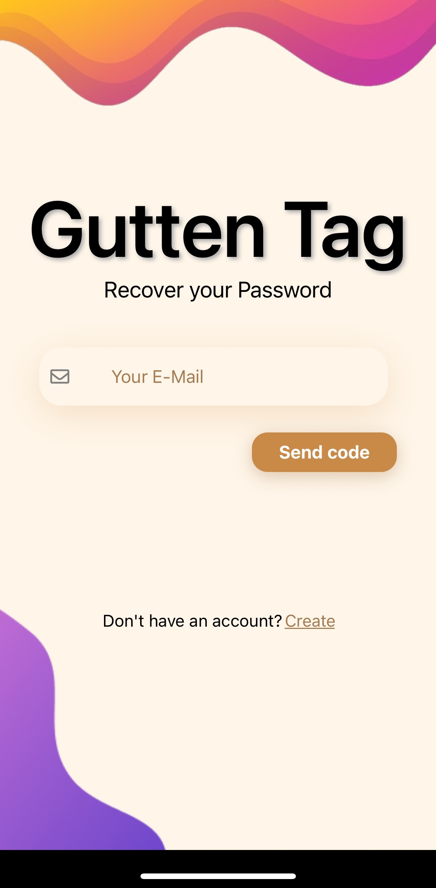
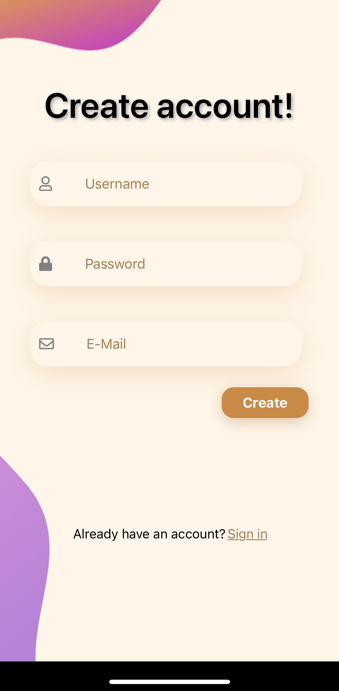

# 🌈 Mobile Learning App

Welcome to **Mobile Learning App** — a stylish mobile application for learning foreign words, where studying becomes engaging and beautiful!

---

## ✨ Overview

**Mobile Learning App** is a modern tool for memory training and vocabulary expansion.  
Enjoy interactive flashcards, smooth animations, vibrant gradients, and an intuitive interface.  
This app is designed for those who value comfort, aesthetics, and efficiency in learning!

---

## 🖼️ Screenshots

<p align="center">
  
  
  
  
</p>

---

## 🚀 Features

- **Sign Up & Sign In** — quick start for new and returning users.
- **Password Recovery** — never lose access to your progress.
- **Interactive Flip Cards** — learn words, flip cards, enter answers, and check yourself.
- **Colorful Design** — smooth gradients, shadows, animated icons, and responsive layout.
- **Custom Tab Bar** — animated, gradient bottom navigation bar.
- **Smart Text Handling** — long words always fit nicely on the card.

---

## 🛠️ Technologies Used

| Technology                      | Description                                              |
|----------------------------------|----------------------------------------------------------|
| **React Native**                 | Cross-platform mobile app development                    |
| **Expo**                         | Simplified RN app building and running                   |
| **React Navigation / Expo Router** | Modern routing and navigation                          |
| **react-native-linear-gradient** | Beautiful gradients for backgrounds and elements         |
| **Animated API**                 | Smooth animations and transitions                        |
| **MongoDB + Express (Node.js)**  | Backend and data storage                                 |
| **react-native-vector-icons**    | Icon library for UI                                      |
| **Responsive Layout**            | Support for various screens and devices                  |

---

## ⚡ Quick Start

1. **Install dependencies:**
   ```sh
   npm install
   ```
2. **Start the server:**
   ```
   node Server/server.js
   ```
3. **Start the Expo Project:**   
   ```
   npx expo start   

## 💡 Highlights
|  **Modern UI with gradients and shadows**
|  **Smart handling of long texts on cards**
|  **Animated tab bar icons**
|  **Password recovery via email**
|  **Easy to scale and customize**

## 📧 Feedback
   *If you have suggestions or questions — feel free to reach out!
   Happy learning and enjoy the vibrant experience!*